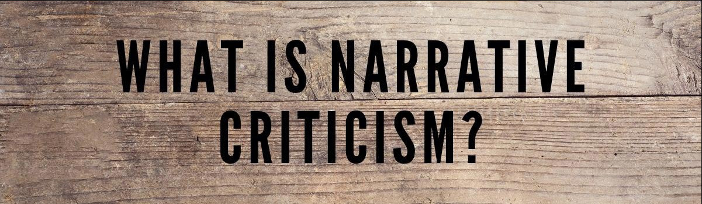
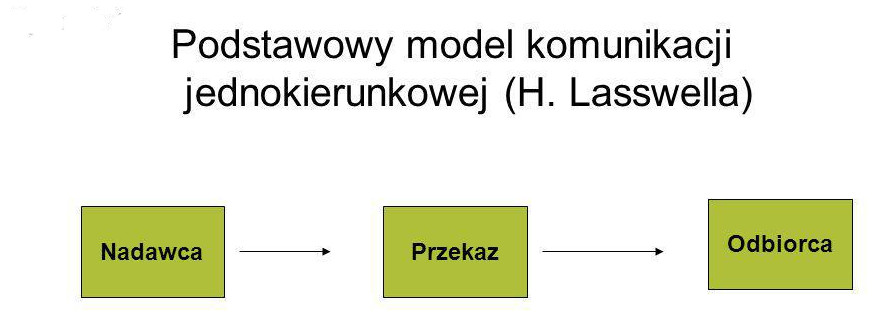
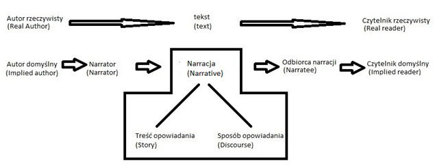
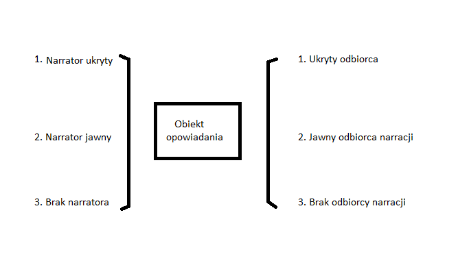
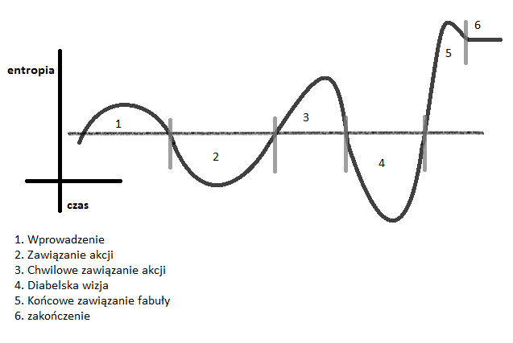

# Analiza narracyjna  <!-- omit in toc -->

>*Opowieści są wszędzie.
Nie tylko my je opowiadamy, one też opowiadają nas:
jeśli opowieści są wszędzie, my też wszędzie jesteśmy w nich.* 

[^1]:A. Bennett, N. Royle, An Introduction to Literature, Criticism and Theory, Routledge, London 2016


**Spis treści**
- [Wprowadzenie](#wprowadzenie)
- [Model komunikacyjny](#model-komunikacyjny)
  - [Autor rzeczywisty i czytelnik rzeczywisty](#autor-rzeczywisty-i-czytelnik-rzeczywisty)
  - [Autor domyślny i czytelnik domyślny](#autor-domyślny-i-czytelnik-domyślny)
  - [Narrator i odbiorca narracji](#narrator-i-odbiorca-narracji)
- [Treść opowiadania (*story*)](#treść-opowiadania-story)
  - [Wydarzenia (*events*) i fabuła (*plot*)](#wydarzenia-events-i-fabuła-plot)
    - [Wydarzenia (*events*)](#wydarzenia-events)
    - [Fabuła (*plot*)](#fabuła-plot)
    - [Prawdopodobienstwo (*verisimilitude*)](#prawdopodobienstwo-verisimilitude)
    - [Hierarchia wydarzeń](#hierarchia-wydarzeń)
    - [Czas w opowiadaniu](#czas-w-opowiadaniu)
    - [Konflikt (*conflict*)](#konflikt-conflict)
  - [Bohaterowie (*characters*)](#bohaterowie-characters)
  - [Okoliczności (*settings*)](#okoliczności-settings)
- [Sposób opowiadania (*discourse*)](#sposób-opowiadania-discourse)
- [Podsumowanie](#podsumowanie)


# Wprowadzenie

Niezależnie od tego, czy mamy do czynienia z historią opowiadaną ustnie, czy zapisaną na papierze, jeżeli tylko przedstawia ona jakieś wydarzenia, w których zachodzi zmiana, mamy do czynienia z narracją. Czasami opowiedziane w tej historii wydarzenia czy przedstawieni bohaterowie tak nas fascynują, że powracamy do niej ponownie. Rzadko któremukolwiek z jej odbiorców przychodzi do głowy pytanie, w jakim celu właściwie została stworzona. Właśnie na to pytanie odpowiada analiza narracyjna.

[Narrative criticism - What is it?](https://www.compellingtruth.org/narrative-criticism.html)

# Model komunikacyjny

Człowiek jest istotą społeczną. W związku z tym od zawsze podejmował próby kontaktu z innymi. Kontakt ten odbywa się po dziś dzień, w swojej podstawowej formie, w następujący sposób: 




Człowiek obok przekazu informacji przedstawiał także różne formy opowiadań. Z czasem ludzie zaczęli je spisywać. Wówczas model komunikacyjny zmienił się na: 

- autor 
- tekst 
- czytelnik. 

Jednak na potrzeby analizy narracyjnej, którą podejmuję w tym opracowaniu, ów model wymaga modyfikacji. Jego podstawowa forma wygląda następująco:
```
autor domyślny – narracja – czytelnik domyślny
```
Nie wskazuje on jednak wszystkich płaszczyzn, które dotyczą narracji, a których badaniem zajmuje się analiza narracji, dlatego lepszy wydaje się model zaprezentowany poniżej:




## Autor rzeczywisty i czytelnik rzeczywisty

Jak można wywnioskować z powyższych schematów komunikacyjnych, autor rzeczywisty i czytelnik rzeczywisty nie wchodzą w krąg zainteresowań analizy narracyjnej, ponieważ stanowiłoby to wykroczenie poza narrację, dlatego poświęcę ich omówieniu niewiele miejsca.

Autor rzeczywisty to ktoś, kto z historycznego punktu widzenia stworzył tekst. Czytelnik rzeczywisty to z kolei osoba lub grupa osób, do których tekst był pierwotnie adresowany. Zarówno autor, jak i czytelnik rzeczywisty to postacie historyczne, istniejące poza tekstem i od niego niezależne. Ich rekonstrukcji można dokonać tylko na zasadzie hipotez lub badań historycznych. Chyba że mamy do czynienia z autorem współczesnym. 

## Autor domyślny i czytelnik domyślny

Dużo bardziej istotny od czytelnika i autora rzeczywistego pozostaje świat opisany w tekście. Nieistotne jest odtwarzanie sylwetek historycznych postaci czy społeczności. Stąd obecność w krytyce narracji takich pojęć jak *autor domyślny* i *czytelnik domyślny* . 

*Autor domyślny* jest rozumiany jako przedmiot strategii narracyjnej, aspekt narracji. Stanowi twór autora rzeczywistego, który przecież umieścił go w tekście. Jego obecność polega na zaprezentowaniu narracji domyślnemu czytelnikowi, który stanowi hipotetyczną konstrukcję. 

*Czytelnik domyślny* jest jakby krytykiem, który poprzez przyjęcie twierdzeń zawartych w tekście będzie próbował na nie odpowiedzieć. Będzie on także zgadzał się z punktem widzenia zaprezentowanym w opowiadaniu. Jest to zatem swego rodzaju rola, w którą czytelnik rzeczywisty może się wcielić lub nie.

## Narrator i odbiorca narracji

Narrator jest tworem autora domyślnego i jednocześnie głosem przekazującym daną narrację . Sposób, w jaki to czyni, jest również wynikiem decyzji autora domyślnego. Należy jednak pamiętać, że nie są oni ze sobą tożsami.
Poza przypadkiem autobiografii opowiadający w tekście literackim nie powinien być utożsamiany z autorem . W przypadku narracji fikcyjnej zdecydowanie nie można mówić o identyfikacji autora z narratorem. Kiedy jednak mamy do czynienia z narracją historycznie rzeczywistą lub prawdziwą autobiografią, wówczas jest odwrotnie. 
Narrator wskazuje na to, co czytelnik powinien wiedzieć i ile należy mu powiedzieć . Dlatego możemy mówić o kilku rodzajach narratorów:
1. **Narrator jako jeden z bohaterów opowiadania**. Mówi w pierwszej osobie singularis lub pluralis. Posiada pewne ograniczenia. Mianowicie może mówić tylko o tym, co widzi, słyszy lub czego doświadcza. Nie może wypowiadać się na temat myśli i odczuć pozostałych bohaterów. Ponadto ograniczają go własne cechy charakteru i systemy wartości, co może zniekształcać prezentowaną przez niego rzeczywistość . Ten rodzaj narratora pojawia się także w autobiografiach.
2. **Narrator wszechwiedzący**. Nie jest bohaterem opowiadania. Czytelnik nie jest do końca świadom jego obecności. Posiada wiedzę na temat myśli i uczuć bohaterów .
3. **Narrator charakteryzujący** się „obiektywną nieomylnością”. Może opowiedzieć wszystko, co może być dostrzeżone, bez pokazywania tego, co myślą główni bohaterowie. Nie jest też bohaterem opowiadania.
4. **Narrator o *ograniczonej wszechwiedzy***. Ujawnia myśli i uczucia bohatera lub bohaterów, ale tylko tych, których uważa za głównych. Sam zaś nie pojawia się w roli jednego z bohaterów narracji.
5. **Narrator charakteryzujący się *nieograniczoną wszechwiedzą***. Może powiedzieć wszystko, co tyczy się świata narracji. Nie jest jego bohaterem. Jest w stanie mówić o tym wszystkim, co tylko pojawia się w myślach bohaterów, niezależnie od czasu i miejsca. Takiego narratora nic nie ogranicza

W przypadku narratora najbardziej istotne jest odnalezienie znaków określających poziom jego słyszalności, a nie określanie jego rodzaju. Im lepiej odczytujemy rysy narracji, tym bardziej jesteśmy świadomi obecności narratora . Jednak istnieje różnica pomiędzy widzialnością a obecnością narratora, ponieważ nawet jeżeli narrator wydaje się mało widoczny, to nie oznacza, że nie jest on w narracji obecny:
1. Narrator jawny
2. Narrator ukryty
3. Brak narratora. 

Odbiorca narracji, podobnie jak narrator, jest zawsze w niej obecny . Chodzi tutaj o tego, komu dana historia jest opowiadana lub o tego, kto zapoznaje się z narracją. Czytelnik wyczuwa, że on lub ona stoi ponad tym opowiadaniem. Jednak jego identyfikacja nie jest łatwa. Może nim być także jeden z bohaterów opowiadania. Może być czytelnikiem lub słuchaczem. Należy pamiętać jednak o tym, że może odgrywać dużą rolę w opowiadanych wydarzeniach. Czasami w toku narracji przechodzi transformację. Może też dojść do tego, że narrator w różnych momentach ma na myśli innego odbiorcę narracji. Czasami może też być identyfikowany z konkretną i rzeczywistą osobą . Odbiorca narracji odgrywa w badaniach nad tekstem bardzo ważną rolę. Czasami tylko on może właściwie odebrać i zinterpretować daną narrację . Należy jednak pamiętać, że rola odbiorcy narracji będzie zależna od przypisanego mu w narracji miejsca. Odbiorcom narracji odpowiadają rodzaje narratorów:





# Treść opowiadania (*story*)

Narrację można rozumieć na trzy sposoby. Po pierwsze, jako aktualny porządek wydarzeń w opowiadaniu. Po drugie, może ona być sekwencją, w której te wydarzenia zachodzą. Po trzecie, narracją można nazwać sam akt opowiadania. Szymik uważa, że wolno mówić o narracji wówczas, gdy w tekście literackim mamy do czynienia z transformacją, czyli taką zmianą sytuacji, która jest nieodwracalna .
Oprócz tak szerokiego ujęcia narracja posiada także dwa aspekty: treść opowiadania (story) i sposób opowiadania (discourse). Treść ukazuje, o czym ona jest i czego dotyczy. Stanowi zatem podstawę narracji .
Treść opowiadania można zdefiniować jako to, co jest komunikowane. Jest to niezbędny element do zaistnienia narracji . Narracja nie może oznaczać tego, co nazywamy historią, ponieważ istnieje różnica pomiędzy przyjętym przez narratora porządkiem narracji, a sytuacjami i wydarzeniami przedstawianymi w opowiadaniu

## Wydarzenia (*events*) i fabuła (*plot*)


### Wydarzenia (*events*)
Wydarzenia (*events*) są zmianą stanu rzeczy, będącą mniej lub bardziej istotną i trwałą modyfikacją w świecie opowiadania . W zależności od tego, z jakiego rodzaju zmianą mamy do czynienia, mogą być albo działaniami (*actions*), albo zdarzeniami (*happenings*). Jeżeli dojdzie do niej w wyniku działania podmiotu, wówczas mówimy o działaniu. Jeśli jednak zmiana jest efektem poddawania jednej z postaci występującej w narracji jakiemuś działaniu, wówczas można mówić o zdarzeniach. Jeżeli jest to wydarzenie znaczące dla fabuły, wówczas podmiot lub daną postać możemy nazwać bohaterem (*character*) .

### Fabuła (*plot*)
 
 Fabuła jest nieodzownym elementem narracji, ponieważ ją tworzy. Wykorzystuje wydarzenia, aby odpowiedzieć na pytania: „co” i „dlaczego” się wydarzyło. O zaistnieniu wydarzenia decyduje zmiana, której dokonuje bohater, albo taka, która mu się przydarza. Zatem nie ma wydarzeń bez bohaterów. Podobnie jak nie ma fabuły bez wydarzeń . Powstaje poprzez wybieranie i porządkowanie wydarzeń, aby tworzyły sekwencję narracyjną . Jest unikalną strukturą łączącą wydarzenia i organizującą je tak, aby stanowiły swoją kontynuację . Organizuje ona narrację i czyni prawdopodobną. 
 ```
 Fabuła powinna być tak skonstruowana, aby nieustannie wzbudzać zainteresowanie czytelnika i jego emocjonalne zaangażowanie przy jednoczesnym nasycaniu wydarzeń odpowiednimi znaczeniami
 ```
 

### Prawdopodobienstwo (*verisimilitude*)
Prawdopodobieństwo (*verisimilitude*) stanowi jedną z podstawowych form łączących w narracji. Bardzo często utrzymuje ono jej spójność . Genette zauważa, że jego podstaw należy upatrywać w przekonaniu ogółu o wspólnym znaczeniu jakiegoś terminu. Prawdopodobieństwo odnosi się nie do rzeczywistości przypadkowej, ale do wyidealizowanej. Nie do rzeczy istniejących, ale do wyimaginowanych. Opisuje je takimi, jakimi powinny być, a nie takimi, jakimi są . W przypadku, kiedy prawdopodobieństwo jest utrzymywane w narracji poprzez opisy detali takich jak wnętrza pokoi, wygląd zewnętrzny pomniejszych bohaterów, pogoda czy np. opisy dźwięków znajdujących się w tle, wówczas możemy mówić o efekcie realności (*reality effect*) .

### Hierarchia wydarzeń
Oprócz logicznych powiązań wydarzenia w narracji charakteryzują się również pewną hierarchią. Z jakiegoś powodu jedne są ważniejsze od drugich. W tradycyjnej narracji tylko ważne wydarzenia należą do głównego planu i tworzą łańcuch przyczynowo-skutkowy. Wydarzenia pomniejsze nie wchodzą w jego skład .
Wydarzenia istotne (kernels)  nie mogą być pominięte w narracji, ponieważ ukazują kierunek jej interpretacji. 

### Czas w opowiadaniu

Czas jest równie ważnym elementem w narracji dotyczącym wydarzeń. Czas czytania danego tekstu różni się zazwyczaj od czasu, który płynie w narracji. Stąd rozróżnienie na czas czytania (*reading-time*) i czas fabuły (*plot-time*). Czas czytania dotyczy kolejności, w jakiej narrator przedstawia czytelnikowi wydarzenia. Natomiast czas fabuły dotyczy kolejności, w której zostały one ułożone przez autora domyślnego, aby pojawiały się w narracji i tworzyły świat opowiadania . Pomiędzy podanymi rodzajami czasu zachodzą relacje. Dlatego Genette w ramach relacji czasowych pomiędzy wyżej wymienionymi elementami wyróżnił: kolejność (*order*), czas trwania (*duration*) i częstotliwość (*frequency*).

**Kolejność (*order*)** łączy się z tym, jak czas jest rozwijany przez narratora, a także z tym, kto i kiedy może stać się bohaterem opowiadania . Odnosi się do różnicy pomiędzy czasem opowiadania a czasem czytania. Wskazuje także na wszelkie zaburzenia chronologii w narracji . Wpływa na to, w jakim porządku czasowym pojawiają się w narracji wydarzenia.

Informacje na temat częstotliwości można przedstawić w postaci tabeli, w której *n* oznacza wielokrotność, *s* – liczbę wydarzeń, *N* – liczbę wzmianek w narracji na temat owych wydarzeń:


| Rodzaj częstotliwości | Schemat częstotliwości | Przykład |
| ---- | ----------- | ---- |
| Narracja pojedyncza   | 1N/1s     | Wczoraj położyłem się wcześnie spać.   |
| Wielokrotnie pojedyncza narracja   | Nn/ns     | Wieczorem położyłem się wcześnie spać, wieczorem położyłem się wcześnie spać, wieczorem położyłem się wcześnie spać.   |
| Narracja iteracyjna  | 1N/ns       | Codziennie przez tydzień kładłem się wcześnie spać.   |


### Konflikt (*conflict*)

Kolejnym, jednym z ważniejszych elementów narracji, wpływających na kształt narracji, jest konflikt (*conflict*). Jest to czynnik, który w największym stopniu buduje napięcie w narracji. Scala opowiadania. Bez niego stanowiłyby tylko sekwencję wydarzeń, które byłyby co prawda połączone, ale nie istniałoby między nimi żadne napięcie. Stanowi więc serce wielu opowiadań .

Konflikty w dzisiejszych narracjach niekoniecznie muszą być związane z podziałem na dobro i zło. Rozbudowane opowiadanie zawiera ich kilka i mogą dotyczyć w zasadzie wszystkiego . Bez nich opowiadania byłyby – tak jak nasze życie – nudne i monotonne. 

Można wyróżnić następujące rodzaje konfliktów:
1) **zewnętrzne (*external*)**, czyli prowadzone pomiędzy dwoma bohaterami opowiadania; wśród nich wyróżniamy:
- konflikty pomiędzy bohaterami,
- konflikty z naturą,
- konflikty z „mocami” nadnaturalnymi,
- konflikt ze społecznością,
2. **wewnętrzne (*internal*)** – chodzi tutaj o konflikty, w których bohaterowie się znajdują zazwyczaj sami ze sobą, z wartościami lub wyborem jednej z opcji; są to:
- konflikty skierowane przeciwko złym pożądaniom i wartościom,
- konflikty decyzji,
- konflikty pomiędzy protagonistą a jego własnymi celami. 


## Bohaterowie (*characters*)

Bohaterowie stanowią dla czytelnika najważniejszą, bo najbardziej zauważalną część narracji. Zazwyczaj o tym, czy odbiorca zapozna się z całością opowiadania decyduje to, jakimi uczuciami obdarzył on głównych bohaterów . Przecież jeżeli mówimy o literaturze, zazwyczaj mamy na myśli opowiadanie nie o ideach, ale właśnie o ludziach lub ich odpowiednikach; obejmuje ono także kwestię ich odczuć , dzięki czemu bohaterowie przypominają czytelnikom ich samych. Nie jest to efekt przypadkowy.

Wiemy, że bohater nie jest rzeczywistą postacią z krwi i kości, a jedynie „papierowym wytworem” obecnym w narracji. Jednak zapoznając się z opowiadaniem, w którym zostały mu przypisane emocje i cechy, zapominamy o tym. Zaczynamy dostrzegać w nim kogoś podobnego do nas samych. Kogoś, kto posiada cechy ludzkie. Jest to tzw. efekt bohatera (*character effects*). Zachodzi on dokładnie wtedy, gdy podobieństwo pomiędzy istotą ludzką a fikcyjnym wymysłem literackim jest tak wielkie, że zapominamy o podstawowych różnicach pomiędzy nimi .

## Okoliczności (*settings*)

Tak jak bohaterowie charakteryzują się różnymi cechami, tak każda historia ma swoje tło. Wszystkie wydarzenia, z którymi styka się czytelnik, odbywają się w konkretnym miejscu lub w pewnym czasie. Bohaterowie tych wydarzeń zostali ponadto ukształtowani przez konkretne środowisko społeczne i kulturę . Wszystko to, co przedstawiane jest czytelnikowi jako element tła prezentowanego świata narracji, można ująć jednym wspólnym określeniem – okoliczności (*settings*) . Są one bardzo ważne. Stanowią jakby tło fabuły. Jednak ich drugim o wiele ważniejszym zadaniem jest uatrakcyjnienie narracji

# Sposób opowiadania (*discourse*)
Treść opowiadania nie przyciągałaby czytelnika, gdyby nie sposób, w jaki została opowiedziana. Stąd wielu narratologów uważa, że to właśnie sposób opowiadania (*discourse*) stanowi najważniejszy element narracji. Co prawda łączy się on ściśle z treścią opowiadania (*story*), jednak na potrzeby naukowego opracowania mogą one zostać od siebie oddzielone. Skoro treść opowiadania została omówiona przed chwilą, teraz przyszedł czas na sposób jej opowiedzenia (*discourse*).
```
Sposób opowiadania odpowiada na bardzo ważne pytanie: „w jaki sposób narracja komunikuje informacje jej odbiorcy?”
``` 
Jest to zatem sposób komunikacji narracji, której nadawane jest pewne znaczenie. Można powiedzieć, że jest to też pewnego rodzaju forma ekspresji, stanowisko narracyjne . Pokazuje ono, w jaki sposób autor wpłynął na opowiadanie . A może to uczynić za pomocą kilku elementów: nadania słowom i konstrukcjom narracyjnym zamierzonego znaczenia, a także za pośrednictwem prezentowanego punktu widzenia i zabiegów retorycznych zastosowanych w narracji.


# Podsumowanie
Powyżej przedstawiona została teoria analizy narracyjnej.Na analizie narracyjnej zmodyfikowany został więc podstawowy schemat komunikacyjny, w którym pojawił się autor domyślny. Z punktu widzenia metody stanowi on element mający największy wpływ na kształt tekstu, a jednocześnie jego punkt widzenia i metody stanowią klucz do zrozumienia narracji. Analiza narracyjna ma bowiem przede wszystkim odpowiedzieć na pytanie dotyczące zamysłu autora domyślnego. W tym celu należy odnaleźć i odczytać znaki pozostawione w tekście. Tylko dzięki nim można dokonać właściwej interpretacji tekstu i w ten sposób pozwolić, aby wpłynęła ona na życie jego odbiorcy. Czytelnik ma wcielić się w rolę czytelnika domyślnego i zapoznać się z tekstem tak, jakby to właśnie z myślą o nim był tworzony. Wymaga to od niego posiadania konkretnej wiedzy, a także otwarcia się na działanie autora domyślnego.


 ```
    started_in = os.getcwd()
    download_content(terminology_url, terminology_languages)
    os.chdir(started_in)
    ```